# movie_booking_clojure

多线程并发影院订票系统（Clojure版）

## Flowchart

```mermaid
graph TD
    subgraph A [-main]
        direction TB
        subgraph B [create-booking-system!]
            direction LR
            B0["create-booking-system!\nCreates a new booking system with a theater and an empty bookings list\nInput: total-seats (integer)\nOutput: **booking-system (map)** containing :theater (atom of boolean vector) and :bookings (atom of vector) keys"]
            B1["create-movie-theater!\nCreates a new theater with all seats initially available\nInput: total-seats (integer)\nOutput: theater (An atom containing a vector of boolean values (false) representing seat availability)"]
            B0 --> B1
        end
        subgraph C [simulate-user!]
            direction TB
            C0["simulate-user!\nSimulates a user interacting with the booking system, including viewing seats, booking, paying, and cancelling\nInput: **booking-system (map)**;\nuser-name (string): A name to identify the simulated user\nOutput: core.async/chan: Returns a channel (as it's a go block), but the main effects are side effects (printing and modifying the booking system)"]
            CN["Note: This system uses core.async to simulate concurrent user operations"]
            D("get-available-seats\nRetrieves a list of available seat numbers in the theater\nInput: **theater (atom)**: An atom containing a vector of boolean values representing seat availability\nOutput: available-seats (vector): A vector of integers representing available seat numbers (1-indexed)")
            E{seq available-seats}
            subgraph F [make-booking!]
                F0["make-booking!\nMakes a booking in the booking system, updating both theater and bookings\nInput: **booking-system (map)**;\nseat-number (integer): The seat number to book (1-indexed)\nOutput: booked (boolean): true if booking is successful, false if unsuccessful"]
                M["Booking Record\nDefines a record type with fields:\n- seat-number: integer\n- paid?: boolean"]
                F0 --> M
            end
            G{booked}
            H("(< (rand) 0.5)")
            I("pay-for-booking!\nMarks a booking as paid in the booking system\nInput: **booking-system (map)**\nseat-number (integer): The seat number to pay for (1-indexed)\nOutput: paid (boolean): true if payment is successful, false if the booking is not found or already paid")
            J("cancel-booking-system!\nCancels a booking in the booking system and updates both theater and bookings\nInput: **booking-system (map)**\nseat-number (integer): The seat number to cancel (1-indexed)\nOutput: cancelled (boolean): true if cancellation is successful, false if unsuccessful")
            K["get-available-seats\nRetrieves a list of available seat numbers in the theater\nInput: **theater (atom)**: An atom containing a vector of boolean values representing seat availability\nOutput: available-seats (vector): A vector of integers representing available seat numbers (1-indexed)"]
            L["Error Handling\nCatches and logs any exceptions that occur during user simulation"]

            C0 --> D
            D --> E
            E -->|not empty| F
            E -->|empty| K
            F --> G
            G -->|true| H
            G -->|false| K
            H --> |true| I
            H --> |false| J
            I --> K
            J --> K
        end

        B -->|"**booking-system (map)**"| C
    end
```

## Installation

Download from http://example.com/FIXME.

## Usage

FIXME: explanation

    $ java -jar movie_booking_clojure-0.1.0-standalone.jar [args]

## Options

FIXME: listing of options this app accepts.

## Examples

...

### Bugs

...

### Any Other Sections
### That You Think
### Might be Useful

## License

Copyright © 2024 FIXME

This program and the accompanying materials are made available under the
terms of the Eclipse Public License 2.0 which is available at
http://www.eclipse.org/legal/epl-2.0.

This Source Code may also be made available under the following Secondary
Licenses when the conditions for such availability set forth in the Eclipse
Public License, v. 2.0 are satisfied: GNU General Public License as published by
the Free Software Foundation, either version 2 of the License, or (at your
option) any later version, with the GNU Classpath Exception which is available
at https://www.gnu.org/software/classpath/license.html.
