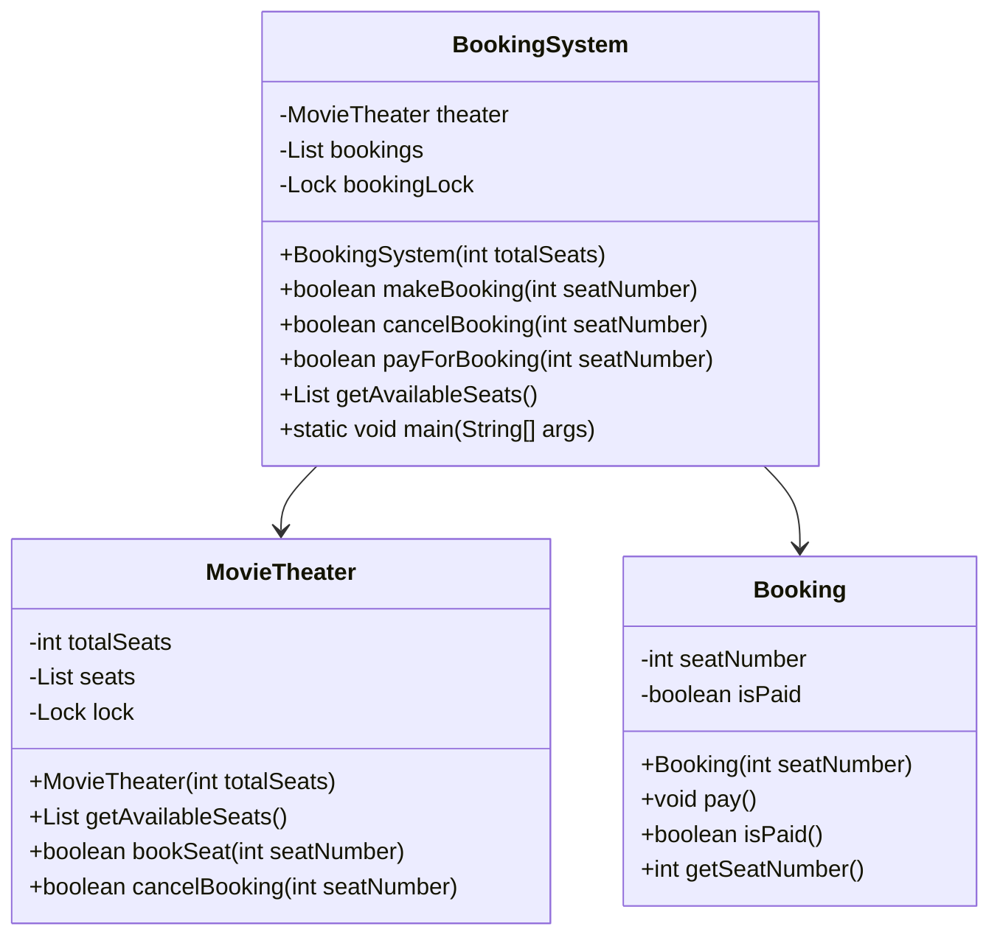

# movie_booking_java

多线程并发影院订票系统（Java版）

## Class Diagram

```mermaid
classDiagram
    class MovieTheater {
        -int totalSeats
        -List<Boolean> seats
        -Lock lock
        +MovieTheater(int totalSeats)
        +List<Integer> getAvailableSeats()
        +boolean bookSeat(int seatNumber)
        +boolean cancelBooking(int seatNumber)
    }
    class Booking {
        -int seatNumber
        -boolean isPaid
        +Booking(int seatNumber)
        +void pay()
        +boolean isPaid()
        +int getSeatNumber()
    }
    class BookingSystem {
        -MovieTheater theater
        -List<Booking> bookings
        -Lock bookingLock
        +BookingSystem(int totalSeats)
        +boolean makeBooking(int seatNumber)
        +boolean cancelBooking(int seatNumber)
        +boolean payForBooking(int seatNumber)
        +List<Integer> getAvailableSeats()
        +static void main(String[] args)
    }

    BookingSystem --> MovieTheater
    BookingSystem --> Booking
```
