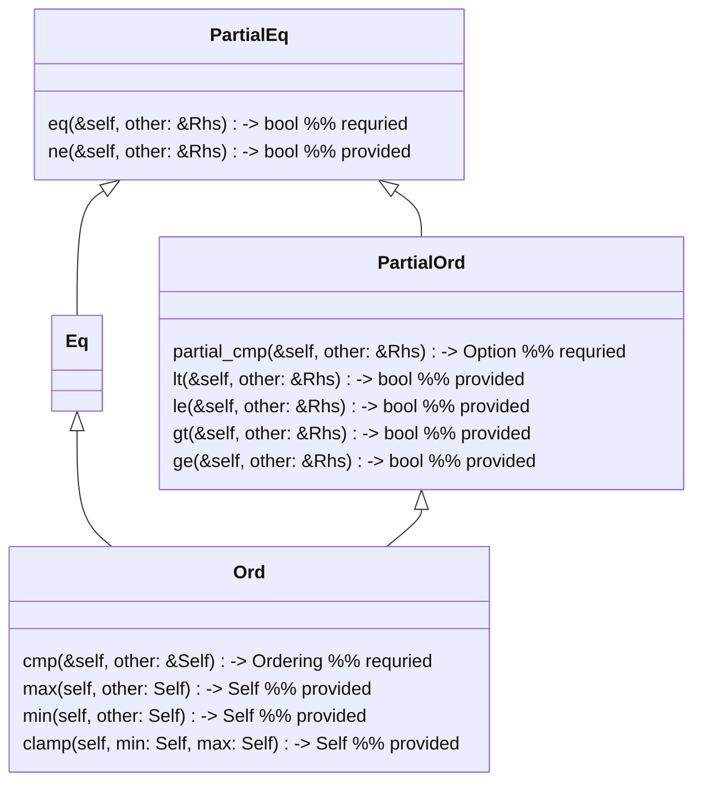
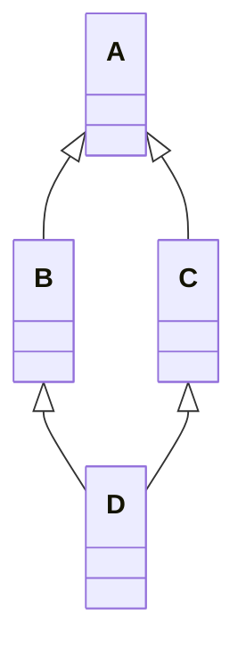

# Class Diagram

```mermaid
classDiagram
    PartialEq <|-- Eq
    PartialEq <|-- PartialOrd
    Eq <|-- Ord
    PartialOrd <|-- Ord

    class PartialEq {
        eq(&self, other: &Rhs) -> bool %% requried
        ne(&self, other: &Rhs) -> bool %% provided
    }
    class Eq {
    }
    class PartialOrd {
        partial_cmp(&self, other: &Rhs) -> Option<Ordering> %% requried
        lt(&self, other: &Rhs) -> bool %% provided
        le(&self, other: &Rhs) -> bool %% provided
        gt(&self, other: &Rhs) -> bool %% provided
        ge(&self, other: &Rhs) -> bool %% provided
    }
    class Ord {
        cmp(&self, other: &Self) -> Ordering %% requried
        max(self, other: Self) -> Self %% provided
        min(self, other: Self) -> Self %% provided
        clamp(self, min: Self, max: Self) -> Self %% provided
    }
```

# The diamond problem

```mermaid
classDiagram
    class A {
    }
    class B {
    }
    class C {
    }
    class D {
    }

    A <|-- B
    A <|-- C
    B <|-- D
    C <|-- D    
```