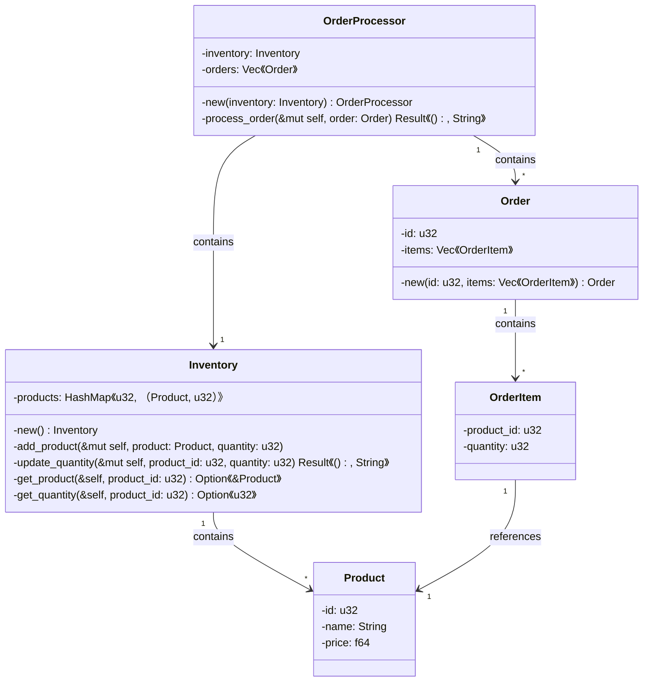

# Class diagram

```mermaid
classDiagram
    class Product {
        -id: u32
        -name: String
        -price: f64
    }
    
    class Inventory {
        -products: HashMap《u32, （Product, u32）》
        -new() Inventory
        -add_product(&mut self, product: Product, quantity: u32)
        -update_quantity(&mut self, product_id: u32, quantity: u32) Result《(), String》
        -get_product(&self, product_id: u32) Option《&Product》
        -get_quantity(&self, product_id: u32) Option《u32》
    }

    class OrderItem {
        -product_id: u32
        -quantity: u32
    }
    
    class Order {
        -id: u32
        -items: Vec《OrderItem》
        -new(id: u32, items: Vec《OrderItem》) Order
    }
    
    class OrderProcessor {
        -inventory: Inventory
        -orders: Vec《Order》
        -new(inventory: Inventory) OrderProcessor
        -process_order(&mut self, order: Order) Result《(), String》
    }
    
    Inventory "1" --> "*" Product : contains
    OrderProcessor "1" --> "1" Inventory : contains
    OrderProcessor "1" --> "*" Order : contains
    Order "1" --> "*" OrderItem : contains
    OrderItem "1" --> "1" Product : references
```