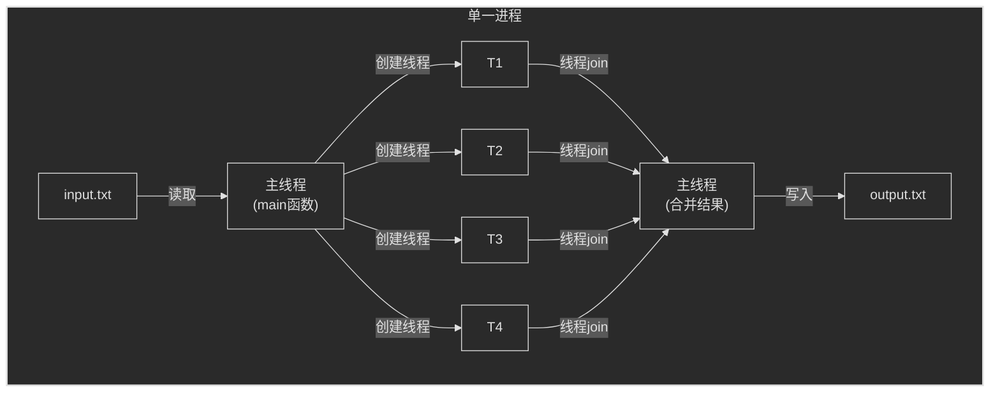
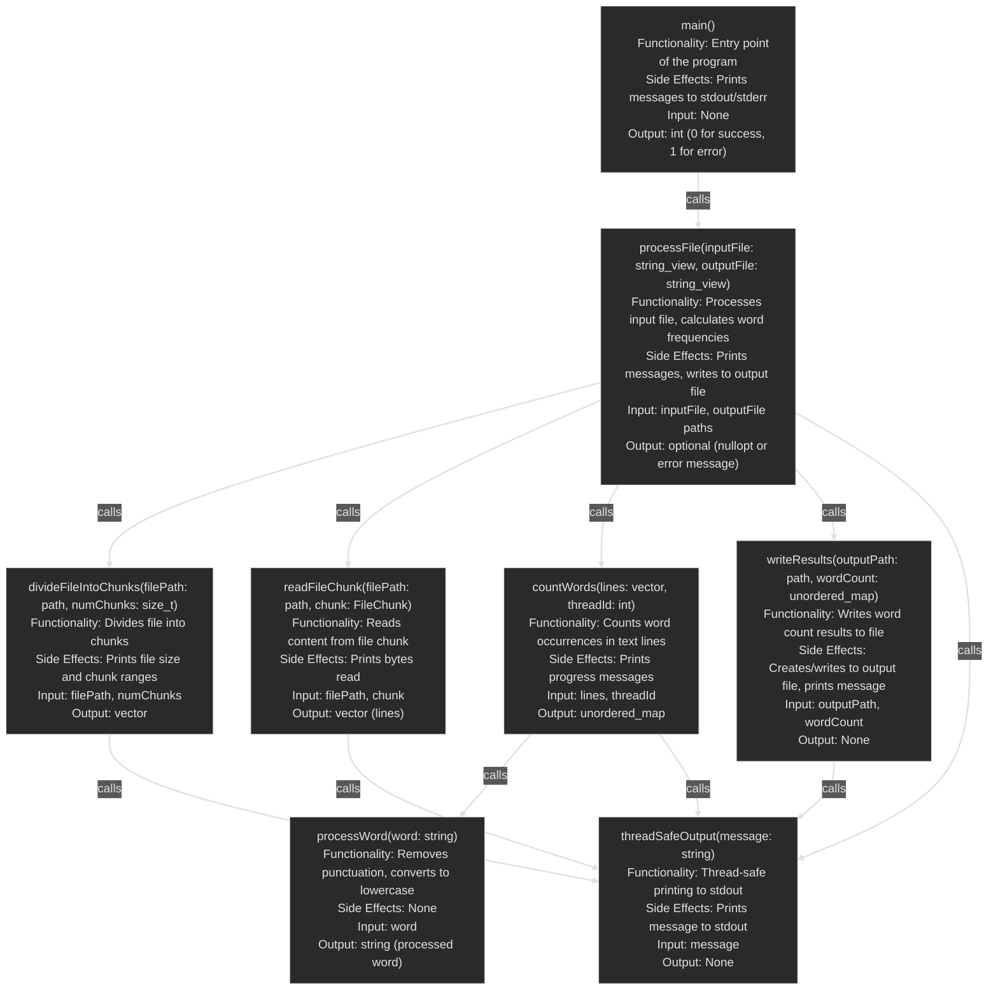

# word_count_cpp

This is the word_count_cpp project.

# Parallel Word Count Workflow Diagram



# function diagram



# API documentation

## countWords

```
Function Name: countWords

Functionality:
Counts the occurrences of words in the given lines of text. The function processes each word (removes punctuation and converts to lowercase), then updates the word count. It outputs a progress message every 10,000 words processed and a completion message when finished.

Side Effects:
- Prints progress and completion messages using threadSafeOutput function

Input Parameters:
- lines: const std::vector<std::string>&
  A collection of text lines to process
- threadId: int
  The ID of the thread executing this function, used for logging

Output:
- Return Type: std::unordered_map<std::string, std::size_t>
- Business Meaning: A map where keys are processed words and values are the number of occurrences of each word in the input text

Notes:
- The function is marked as [[nodiscard]] and noexcept
- Uses processWord function to process each word
```

## divideFileIntoChunks

```
Function Name: divideFileIntoChunks

Functionality:
Divides the given file into a specified number of chunks. It calculates the file size and then creates chunks of equal size (the last chunk may be slightly larger).

Side Effects:
- Prints the file size and range of each chunk using threadSafeOutput function

Input Parameters:
- filePath: const std::filesystem::path&
  The path of the file to be divided
- numChunks: std::size_t
  The number of chunks to create

Output:
- Return Type: std::vector<FileChunk>
- Business Meaning: A vector of FileChunk structures, each defining the start and end positions of a chunk in the file

Notes:
- The function is marked as [[nodiscard]] and inline
- Throws std::runtime_error if unable to open the file
```

## main

```
Function Name: main

Functionality:
The entry point of the program. It defines input and output file paths, initiates the word count process, and handles potential errors.

Side Effects:
- Prints start and completion messages using threadSafeOutput function
- Prints error messages to standard error stream if an error occurs

Input Parameters: None

Output:
- Return Type: int
- Business Meaning: Returns 0 for successful execution, 1 if an error occurred

Notes:
- Uses constexpr std::string_view for input and output file paths
- Calls processFile function to perform the word count process
```

## processFile

```
Function Name: processFile

Functionality:
Processes the input file, calculates word frequencies, and writes the results to the output file. It uses multithreading to process different parts of the file in parallel.

Side Effects:
- Prints various processing stage messages using threadSafeOutput function
- Creates and writes to the output file

Input Parameters:
- inputFile: std::string_view
  The path of the input file to process
- outputFile: std::string_view
  The path of the output file to write results to

Output:
- Return Type: std::optional<std::string>
- Business Meaning: Returns std::nullopt if processing is successful; returns a string containing an error message if an error occurs

Notes:
- The function is marked as [[nodiscard]] and inline noexcept
- Uses std::chrono to measure processing time
- Creates NUM_THREADS threads to process file chunks in parallel
```

## processWord

```
Function Name: processWord

Functionality:
Processes a single word by removing all punctuation and converting it to lowercase.

Side Effects: None

Input Parameters:
- word: const std::string&
  The original word to process

Output:
- Return Type: std::string
- Business Meaning: Returns the processed word (without punctuation, all lowercase)

Notes:
- The function is marked as inline
- Uses std::remove_if and std::transform for processing
```

## readFileChunk

```
Function Name: readFileChunk

Functionality:
Reads content from a specified chunk of a file and splits it into lines.

Side Effects:
- Prints the number of bytes read using threadSafeOutput function

Input Parameters:
- filePath: const std::filesystem::path&
  The path of the file to read from
- chunk: const FileChunk&
  Defines the start and end positions of the file chunk to read

Output:
- Return Type: std::vector<std::string>
- Business Meaning: A vector containing all lines read from the specified file chunk

Notes:
- The function is marked as [[nodiscard]] and inline
- Uses a buffer of size BUFFER_SIZE (8192 bytes) for reading
- Throws std::runtime_error if unable to open the file
```

## threadSafeOutput

```
Function Name: threadSafeOutput

Functionality:
Prints a message to standard output in a thread-safe manner.

Side Effects:
- Prints the given message to standard output

Input Parameters:
- message: const std::string&
  The message to print

Output: None

Notes:
- Uses std::lock_guard with std::mutex for thread safety
```

## writeResults

```
Function Name: writeResults

Functionality:
Writes the word count results to the specified output file.

Side Effects:
- Creates and writes to the output file
- Prints a completion message using threadSafeOutput function

Input Parameters:
- outputPath: const std::filesystem::path&
  The path of the output file to write results to
- wordCount: const std::unordered_map<std::string, std::size_t>&
  A map containing words and their occurrence counts

Output: None

Notes:
- The function is marked as inline
- Sorts words alphabetically before writing to the file
- Throws std::runtime_error if unable to open the output file
```

# Building and installing

See the [BUILDING](BUILDING.md) document.

# Contributing

See the [CONTRIBUTING](CONTRIBUTING.md) document.

# Licensing

<!--
Please go to https://choosealicense.com/licenses/ and choose a license that
fits your needs. The recommended license for a project of this type is the
GNU AGPLv3.
-->
