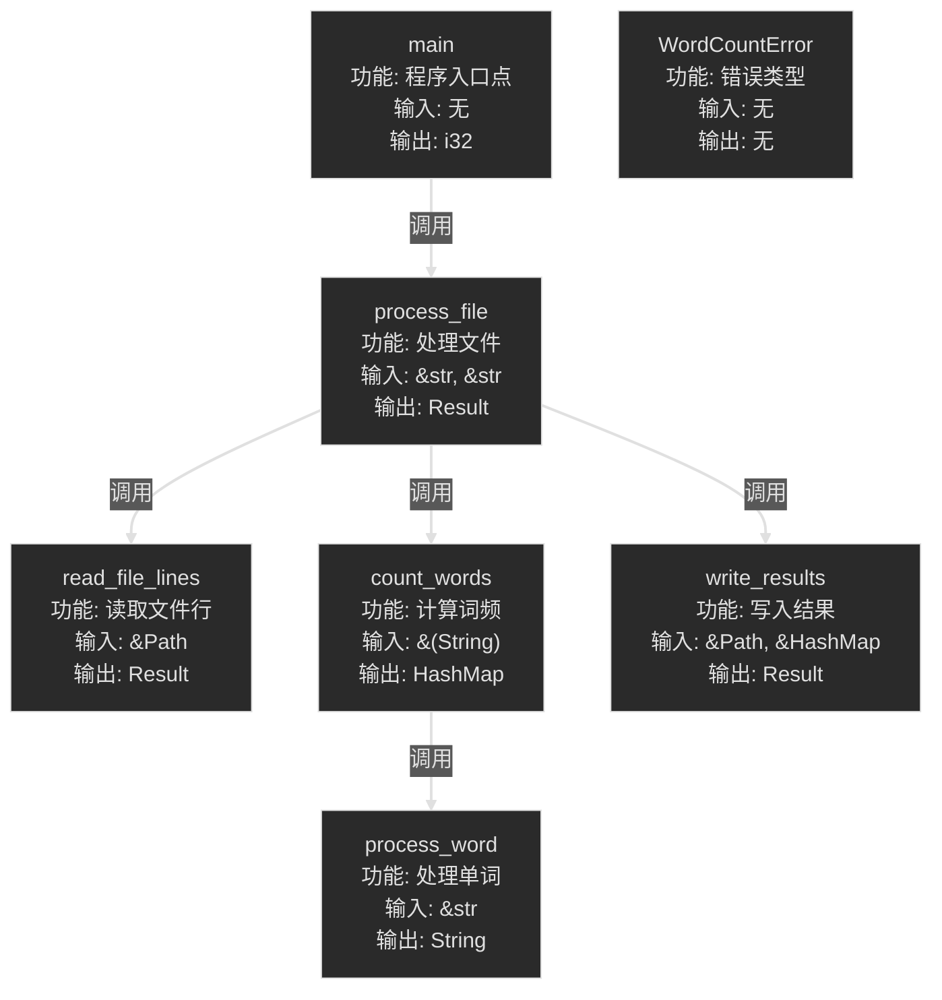

# Function call diagram

```mermaid
%%{init: {'theme': 'dark', 'themeVariables': { 'primaryColor': '#e0e0e0', 'textColor': '#e0e0e0', 'lineColor': '#e0e0e0'}}}%%
graph TD
    classDef default fill:#2a2a2a,stroke:#e0e0e0,color:#e0e0e0;

    A["main<br>功能: 程序入口点<br>输入: 无<br>输出: i32"] -->|调用| B

    B["process_file<br>功能: 处理文件<br>输入: &str, &str<br>输出: Result"]
    B -->|调用| C
    B -->|调用| D
    B -->|调用| E

    C["read_file_lines<br>功能: 读取文件行<br>输入: &Path<br>输出: Result"]

    D["count_words<br>功能: 计算词频<br>输入: &(String)<br>输出: HashMap"]
    D -->|调用| F

    E["write_results<br>功能: 写入结果<br>输入: &Path, &HashMap<br>输出: Result"]

    F["process_word<br>功能: 处理单词<br>输入: &str<br>输出: String"]

    G["WordCountError<br>功能: 错误类型<br>输入: 无<br>输出: 无"]

    linkStyle default stroke:#e0e0e0,stroke-width:2px
```