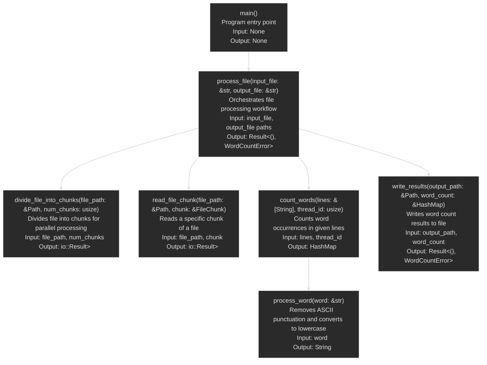

# Function call diagram

Based on the provided Rust code, I'll update the API documentation. Here's the revised version:

# API Documentation

## count_words

**Function**: Counts the occurrences of words in a given list of strings.

**Input Parameters**:
- `lines`: &[String] - A slice of strings, each representing a line of text to process.
- `thread_id`: usize - An identifier for the thread processing this chunk of data.

**Output**:
- `HashMap<String, usize>` - A hash map where keys are processed words and values are their occurrence counts.

**Side Effects**:
- Prints progress messages to the console every 10,000 words processed.
- Prints a completion message when finished processing.

## divide_file_into_chunks

**Function**: Divides a file into a specified number of chunks for parallel processing.

**Input Parameters**:
- `file_path`: &Path - The path to the file to be divided.
- `num_chunks`: usize - The number of chunks to divide the file into.

**Output**:
- `io::Result<Vec<FileChunk>>` - A Result containing a vector of FileChunk structs if successful, or an IO error if unsuccessful.

**Side Effects**:
- Prints file size and individual chunk information to the console.

## main

**Function**: The entry point of the program. Initiates the word count process on a specified input file and writes results to an output file.

**Input Parameters**: None

**Output**: None

**Side Effects**:
- Prints start and completion messages to the console.
- Exits the program with a status code of 1 if an error occurs.

## process_file

**Function**: Orchestrates the entire file processing workflow, including dividing the file, counting words, and writing results.

**Input Parameters**:
- `input_file`: &str - The path to the input file as a string.
- `output_file`: &str - The path to the output file as a string.

**Output**:
- `Result<(), WordCountError>` - Ok(()) if processing completes successfully, or a WordCountError if an error occurs.

**Side Effects**:
- Spawns multiple threads for parallel processing.
- Prints various progress and timing messages to the console.
- Writes word count results to the output file.
- Measures and prints the total processing time.

## process_word

**Function**: Processes a word by removing ASCII punctuation and converting to lowercase.

**Input Parameters**:
- `word`: &str - The word to process.

**Output**:
- `String` - The processed word.

**Side Effects**: None

## read_file_chunk

**Function**: Reads a specific chunk of a file into memory.

**Input Parameters**:
- `file_path`: &Path - The path to the file to read from.
- `chunk`: &FileChunk - A reference to a FileChunk struct specifying the start and end positions to read.

**Output**:
- `io::Result<Vec<String>>` - A Result containing a vector of strings (lines read from the file) if successful, or an IO error if unsuccessful.

**Side Effects**:
- Prints the number of bytes read from the chunk to the console.

## write_results

**Function**: Writes the word count results to an output file.

**Input Parameters**:
- `output_path`: &Path - The path to the output file.
- `word_count`: &HashMap<String, usize> - A reference to a hash map containing word counts.

**Output**:
- `Result<(), WordCountError>` - Ok(()) if writing completes successfully, or a WordCountError if an error occurs.

**Side Effects**:
- Creates or overwrites the output file.
- Writes word count data to the output file in alphabetical order.
- Prints a completion message to the console.