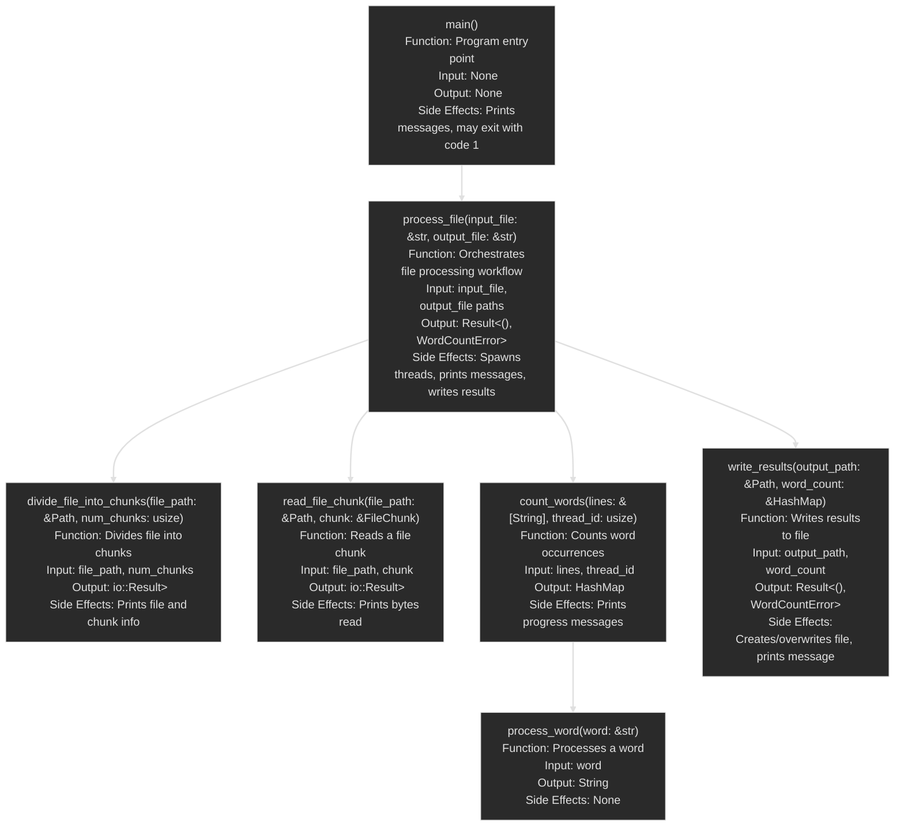

# Function call diagram



# API Documentation

### count_words

**Function**: Counts the occurrences of words in a given list of strings.

**Input Parameters**:
- `lines`: &[String] - A slice of strings, each representing a line of text to process.
- `thread_id`: usize - An identifier for the thread processing this chunk of data.

**Output**:
- `HashMap<String, usize>` - A hash map where keys are processed words and values are their occurrence counts.

**Side Effects**:
- Prints progress messages to the console at regular intervals.
- Prints a completion message when finished processing.

### divide_file_into_chunks

**Function**: Divides a file into a specified number of chunks for parallel processing.

**Input Parameters**:
- `file_path`: &Path - The path to the file to be divided.
- `num_chunks`: usize - The number of chunks to divide the file into.

**Output**:
- `io::Result<Vec<FileChunk>>` - A Result containing a vector of FileChunk structs if successful, or an IO error if unsuccessful.

**Side Effects**:
- Prints file size and chunk information to the console.

### main

**Function**: The entry point of the program. Initiates the word count process on a specified input file and writes results to an output file.

**Input Parameters**: None

**Output**: None

**Side Effects**:
- Prints start and completion messages to the console.
- Exits the program with a status code of 1 if an error occurs.

### process_file

**Function**: Orchestrates the entire file processing workflow, including dividing the file, counting words, and writing results.

**Input Parameters**:
- `input_file`: &str - The path to the input file as a string.
- `output_file`: &str - The path to the output file as a string.

**Output**:
- `Result<(), WordCountError>` - Ok(()) if processing completes successfully, or a WordCountError if an error occurs.

**Side Effects**:
- Spawns multiple threads for parallel processing.
- Prints various progress and timing messages to the console.
- Writes word count results to the output file.

### process_word

**Function**: Processes a word by removing punctuation and converting to lowercase.

**Input Parameters**:
- `word`: &str - The word to process.

**Output**:
- `String` - The processed word.

**Side Effects**: None

### read_file_chunk

**Function**: Reads a specific chunk of a file into memory.

**Input Parameters**:
- `file_path`: &Path - The path to the file to read from.
- `chunk`: &FileChunk - A reference to a FileChunk struct specifying the start and end positions to read.

**Output**:
- `io::Result<Vec<String>>` - A Result containing a vector of strings (lines read from the file) if successful, or an IO error if unsuccessful.

**Side Effects**:
- Prints the number of bytes read from the chunk to the console.

### write_results

**Function**: Writes the word count results to an output file.

**Input Parameters**:
- `output_path`: &Path - The path to the output file.
- `word_count`: &HashMap<String, usize> - A reference to a hash map containing word counts.

**Output**:
- `Result<(), WordCountError>` - Ok(()) if writing completes successfully, or a WordCountError if an error occurs.

**Side Effects**:
- Creates or overwrites the output file.
- Writes word count data to the output file.
- Prints a completion message to the console.

# 如何用Rust的线程sanitizer帮助检测数据竞争？

ThreadSanitizer (TSan) 是一个强大的工具，用于检测多线程代码中的数据竞争。虽然 Rust 的编译器本身通过所有权和借用检查机制大大减少了数据竞争的可能性，但当你在编写涉及到 `unsafe` 代码或者跨语言接口（如 FFI）时，ThreadSanitizer 依然非常有用。以下是如何在 Rust 中使用 ThreadSanitizer 来检测数据竞争的步骤：

## 1. 安装 Nightly 版 Rust
ThreadSanitizer 目前需要使用 Rust 的 Nightly 版来启用。你可以通过以下命令来安装 Nightly 版 Rust：

```bash
rustup install nightly
```

## 2. 用 Nightly 构建

```bash
cargo +nightly build
```

## 3. 启用 ThreadSanitizer
要使用 ThreadSanitizer，需要在构建时启用相应的编译器选项和环境变量。你可以通过以下命令构建和运行代码：

```bash
RUSTFLAGS="-Z sanitizer=thread" cargo +nightly run > sanitizer.txt
```

或者，如果你正在运行测试，可以使用：

```bash
RUSTFLAGS="-Z sanitizer=thread" cargo +nightly test
```

这些命令会在构建过程中启用 ThreadSanitizer，并在运行时检测数据竞争。

## 4. 编译和运行代码
在构建和运行项目后，ThreadSanitizer 会自动分析代码的执行。如果它检测到任何数据竞争，会在终端输出详细的报告，包括发生数据竞争的内存位置、相关的线程、以及代码中的具体位置。

## 5. 注意事项
- **性能影响**：ThreadSanitizer 运行时会有明显的性能开销，因为它需要监控每个内存访问的操作。因此，建议只在调试和测试阶段使用，而不是在生产环境中运行。
- **兼容性**：确保你的 Rust 代码中没有与 ThreadSanitizer 不兼容的部分，例如某些 C/C++ 库可能与 TSan 不完全兼容。


如果代码中存在数据竞争，ThreadSanitizer 会输出详细的错误信息，包括导致数据竞争的线程和具体代码行。

通过使用 ThreadSanitizer，你可以更加深入地检测并解决 Rust 代码中的并发问题，尤其是在涉及不安全代码的情况下。